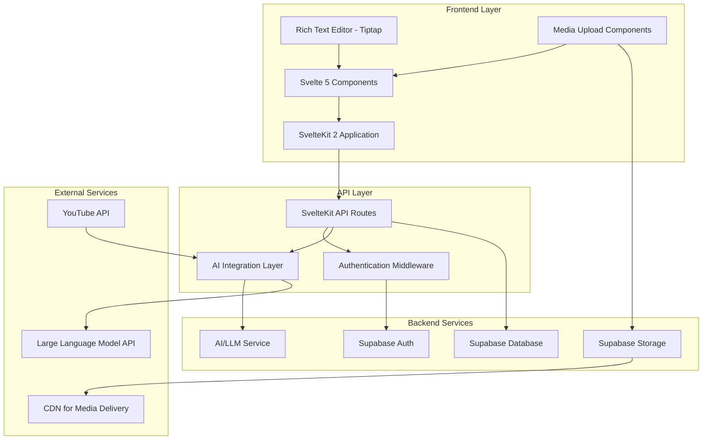

# Design Document

## Overview

The Personalized Learning Management System (LMS) is a modern, open-source educational platform that leverages AI and large language models to create truly personalized learning experiences. Built with Svelte 5 and SvelteKit 2, the system uses Supabase for backend services and integrates advanced AI capabilities for content personalization, assessment generation, and adaptive learning path creation.

The system organizes learning content into a hierarchical structure of courses containing lessons, where each lesson can include multiple media types (images, videos, files, rich text). The core innovation lies in its AI-powered personalization engine that analyzes student knowledge profiles and dynamically generates optimized learning roadmaps.

## Architecture

### High-Level Architecture



### Technology Stack

**Frontend:**
- Svelte 5 for reactive UI components
- SvelteKit 2 for full-stack framework with SSR/SSG capabilities
- Tiptap for rich text editing with ProseMirror foundation
- Tailwind CSS for utility-first styling
- TypeScript for type safety

**Backend:**
- Supabase PostgreSQL for primary database
- Supabase Auth for user authentication and authorization
- Supabase Storage for file and media storage
- Supabase Edge Functions for serverless compute
- Row Level Security (RLS) for data access control

**AI/ML Integration:**
- OpenAI GPT-4 or similar LLM for content analysis and roadmap generation
- Custom AI tools for assessment creation and personalization
- Vector embeddings for content similarity and recommendation

**External Integrations:**
- YouTube Data API v3 for video metadata and embedding
- CDN integration for optimized media delivery

## Components and Interfaces

### Core Data Models

#### User Model
```typescript
interface User {
  id: string;
  email: string;
  role: 'student' | 'instructor' | 'admin';
  profile: UserProfile;
  created_at: string;
  updated_at: string;
}

interface UserProfile {
  first_name: string;
  last_name: string;
  avatar_url?: string;
  learning_preferences: LearningPreferences;
  knowledge_profile: KnowledgeProfile;
}

interface LearningPreferences {
  preferred_pace: 'slow' | 'medium' | 'fast';
  preferred_media_types: MediaType[];
  learning_style: 'visual' | 'auditory' | 'kinesthetic' | 'mixed';
}

interface KnowledgeProfile {
  subject_areas: SubjectKnowledge[];
  skill_levels: SkillLevel[];
  last_assessed: string;
}
```

#### Course and Lesson Models
```typescript
interface Course {
  id: string;
  title: string;
  description: string;
  instructor_id: string;
  lessons: Lesson[];
  final_assessment_id: string; // mandatory final assessment for the course
  tags: string[];
  difficulty_level: 'beginner' | 'intermediate' | 'advanced';
  estimated_duration: number; // in minutes
  is_published: boolean;
  created_at: string;
  updated_at: string;
}

interface Lesson {
  id: string;
  course_id: string;
  title: string;
  description: string;
  order_index: number;
  content_blocks: ContentBlock[];
  learning_objectives: string[];
  estimated_duration: number;
  assessment_id: string; // mandatory assessment for this lesson
  prerequisites: string[]; // lesson IDs that must be completed first
  is_published: boolean;
  created_at: string;
  updated_at: string;
}

interface ContentBlock {
  id: string;
  lesson_id: string;
  type: 'rich_text' | 'image' | 'video' | 'file' | 'youtube';
  content: ContentData;
  order_index: number;
  metadata: ContentMetadata;
}

type ContentData = {
  rich_text?: {
    html: string;
    plain_text: string;
  };
  image?: {
    url: string;
    alt_text: string;
    caption?: string;
  };
  video?: {
    url: string;
    thumbnail_url?: string;
    duration?: number;
  };
  file?: {
    url: string;
    filename: string;
    file_type: string;
    file_size: number;
  };
  youtube?: {
    video_id: string;
    title: string;
    thumbnail_url: string;
    duration: number;
  };
};
```

#### Assessment Models
```typescript
interface Assessment {
  id: string;
  lesson_id?: string;
  course_id?: string;
  title: string;
  description: string;
  questions: Question[];
  ai_generated: boolean;
  source_content_ids: string[];
  is_mandatory: boolean;
  minimum_passing_score: number; // percentage (default 70)
  max_attempts?: number; // null for unlimited
  time_limit?: number; // in minutes, null for no limit
  created_at: string;
  updated_at: string;
}

interface Question {
  id: string;
  type: 'multiple_choice' | 'true_false' | 'short_answer' | 'essay';
  question_text: string;
  options?: string[]; // for multiple choice
  correct_answer: string | string[];
  explanation: string;
  difficulty_level: number; // 1-5 scale
  topics: string[];
  points: number; // points awarded for correct answer
}

interface AssessmentAttempt {
  id: string;
  assessment_id: string;
  student_id: string;
  attempt_number: number;
  answers: AssessmentAnswer[];
  score: number; // percentage
  points_earned: number;
  total_points: number;
  passed: boolean;
  time_spent: number; // in seconds
  started_at: string;
  submitted_at: string;
  feedback: AssessmentFeedback;
}

interface AssessmentAnswer {
  question_id: string;
  student_answer: string | string[];
  is_correct: boolean;
  points_earned: number;
  feedback?: string;
}

interface AssessmentFeedback {
  overall_feedback: string;
  strengths: string[];
  areas_for_improvement: string[];
  recommended_resources: string[];
  next_steps: string;
}
```

#### AI Roadmap Models
```typescript
interface PersonalizedRoadmap {
  id: string;
  student_id: string;
  generated_at: string;
  roadmap_data: RoadmapData;
  ai_reasoning: string;
  status: 'active' | 'completed' | 'paused';
}

interface RoadmapData {
  learning_path: LearningPathItem[];
  estimated_completion_time: number;
  difficulty_progression: DifficultyProgression;
  personalization_factors: PersonalizationFactors;
}

interface LearningPathItem {
  content_id: string;
  content_type: 'lesson' | 'assessment' | 'practice';
  order_index: number;
  estimated_time: number;
  prerequisites: string[];
  learning_objectives: string[];
  personalization_notes: string;
  is_unlocked: boolean;
  completion_status: 'not_started' | 'in_progress' | 'completed' | 'failed';
}

interface StudentProgress {
  id: string;
  student_id: string;
  course_id: string;
  lesson_id?: string;
  assessment_id?: string;
  status: 'not_started' | 'in_progress' | 'completed' | 'blocked';
  completion_percentage: number;
  last_accessed: string;
  time_spent: number; // in seconds
  attempts_count: number;
  best_score?: number;
  created_at: string;
  updated_at: string;
}
```

### Frontend Components Architecture

#### Core Layout Components
- `App.svelte` - Main application shell
- `Navigation.svelte` - Primary navigation with role-based menu items
- `Sidebar.svelte` - Contextual sidebar for course/lesson navigation
- `Header.svelte` - User profile, notifications, and global actions

#### Student Interface Components
- `Dashboard.svelte` - Personalized student dashboard with progress overview
- `RoadmapView.svelte` - AI-generated learning roadmap visualization
- `LessonPlayer.svelte` - Unified lesson content player
- `ProgressTracker.svelte` - Visual progress indicators and analytics
- `AssessmentTaker.svelte` - Assessment interface with various question types
- `AssessmentResults.svelte` - Detailed assessment results and feedback display
- `AssessmentHistory.svelte` - Student's assessment attempt history
- `ProgressGate.svelte` - Component that blocks progression until requirements are met

#### Instructor Interface Components
- `InstructorDashboard.svelte` - Course management and analytics overview
- `CourseEditor.svelte` - Course creation and management interface
- `LessonEditor.svelte` - Rich lesson editor with drag-and-drop content blocks
- `ContentBlockEditor.svelte` - Individual content block editing components
- `AssessmentBuilder.svelte` - AI-assisted assessment creation interface
- `AnalyticsDashboard.svelte` - Student engagement and performance analytics

#### Shared Components
- `RichTextEditor.svelte` - Tiptap-based rich text editor wrapper
- `MediaUploader.svelte` - Multi-format file upload with preview
- `VideoPlayer.svelte` - Unified video player for uploads and YouTube
- `ProgressBar.svelte` - Reusable progress visualization
- `Modal.svelte` - Accessible modal dialog system
- `Toast.svelte` - Notification system

### API Layer Design

#### Progression Control Service
```typescript
export class ProgressionService {
  // Check if student can access specific content
  async canAccessContent(studentId: string, contentId: string, contentType: 'lesson' | 'course'): Promise<boolean> {
    if (contentType === 'lesson') {
      return await this.canAccessLesson(studentId, contentId);
    } else {
      return await this.canAccessCourse(studentId, contentId);
    }
  }
  
  private async canAccessLesson(studentId: string, lessonId: string): Promise<boolean> {
    const lesson = await this.getLessonWithPrerequisites(lessonId);
    
    // Check if all prerequisite lessons are completed
    for (const prereqId of lesson.prerequisites) {
      const progress = await this.getStudentProgress(studentId, prereqId, 'lesson');
      if (!progress || progress.status !== 'completed') {
        return false;
      }
      
      // Check if prerequisite lesson's assessment was passed
      const assessmentPassed = await this.hasPassedAssessment(studentId, lesson.assessment_id);
      if (!assessmentPassed) {
        return false;
      }
    }
    
    return true;
  }
  
  private async hasPassedAssessment(studentId: string, assessmentId: string): Promise<boolean> {
    const bestAttempt = await this.getBestAssessmentAttempt(studentId, assessmentId);
    return bestAttempt?.passed || false;
  }
  
  // Update progress when student completes content
  async updateProgress(studentId: string, contentId: string, contentType: string, data: any): Promise<void> {
    await this.upsertProgress({
      student_id: studentId,
      [contentType + '_id']: contentId,
      ...data,
      updated_at: new Date().toISOString()
    });
    
    // Check if this completion unlocks new content
    await this.checkAndUnlockContent(studentId);
  }
  
  // Generate assessment completion certificate/record
  async generateAssessmentRecord(attemptId: string): Promise<AssessmentRecord> {
    const attempt = await this.getAssessmentAttempt(attemptId);
    const assessment = await this.getAssessment(attempt.assessment_id);
    
    return {
      id: crypto.randomUUID(),
      student_id: attempt.student_id,
      assessment_id: attempt.assessment_id,
      attempt_id: attemptId,
      score: attempt.score,
      passed: attempt.passed,
      completed_at: attempt.submitted_at,
      certificate_data: {
        assessment_title: assessment.title,
        questions_count: assessment.questions.length,
        time_spent: attempt.time_spent,
        detailed_results: attempt.answers
      }
    };
  }
}
```

#### Authentication & Authorization
```typescript
// Middleware for route protection
export const requireAuth = (roles?: UserRole[]) => {
  return async (event: RequestEvent) => {
    const session = await getSession(event);
    if (!session) throw redirect(302, '/login');
    if (roles && !roles.includes(session.user.role)) {
      throw error(403, 'Insufficient permissions');
    }
    return session;
  };
};

// RLS policies in Supabase
CREATE POLICY "Users can view own profile" ON profiles
  FOR SELECT USING (auth.uid() = id);

CREATE POLICY "Instructors can manage own courses" ON courses
  FOR ALL USING (auth.uid() = instructor_id);

CREATE POLICY "Students can view enrolled courses" ON courses
  FOR SELECT USING (
    id IN (
      SELECT course_id FROM enrollments 
      WHERE student_id = auth.uid()
    )
  );
```

#### API Routes Structure
```
/api/
├── auth/
│   ├── login/
│   ├── register/
│   └── profile/
├── courses/
│   ├── [id]/
│   │   ├── lessons/
│   │   ├── enroll/
│   │   └── analytics/
│   └── create/
├── lessons/
│   ├── [id]/
│   │   ├── content/
│   │   └── progress/
│   └── create/
├── assessments/
│   ├── [id]/
│   │   ├── attempt/
│   │   ├── submit/
│   │   ├── results/
│   │   └── history/
│   ├── generate/ (AI-powered)
│   ├── create/
│   └── progress/
│       └── check/
├── ai/
│   ├── roadmap/
│   │   ├── generate/
│   │   └── update/
│   ├── assessment/
│   │   └── generate/
│   └── recommendations/
├── media/
│   ├── upload/
│   ├── youtube/
│   │   └── validate/
│   └── [id]/
└── analytics/
    ├── student/
    └── instructor/
```

## Data Models

### Database Schema

#### Core Tables
```sql
-- Users and Authentication (handled by Supabase Auth)
CREATE TABLE profiles (
  id UUID REFERENCES auth.users PRIMARY KEY,
  email TEXT UNIQUE NOT NULL,
  role user_role NOT NULL DEFAULT 'student',
  first_name TEXT,
  last_name TEXT,
  avatar_url TEXT,
  learning_preferences JSONB,
  knowledge_profile JSONB,
  created_at TIMESTAMP WITH TIME ZONE DEFAULT NOW(),
  updated_at TIMESTAMP WITH TIME ZONE DEFAULT NOW()
);

-- Courses
CREATE TABLE courses (
  id UUID PRIMARY KEY DEFAULT gen_random_uuid(),
  title TEXT NOT NULL,
  description TEXT,
  instructor_id UUID REFERENCES profiles(id) NOT NULL,
  final_assessment_id UUID, -- Will be set after assessment creation
  tags TEXT[],
  difficulty_level difficulty_level NOT NULL,
  estimated_duration INTEGER, -- in minutes
  is_published BOOLEAN DEFAULT FALSE,
  created_at TIMESTAMP WITH TIME ZONE DEFAULT NOW(),
  updated_at TIMESTAMP WITH TIME ZONE DEFAULT NOW()
);

-- Lessons
CREATE TABLE lessons (
  id UUID PRIMARY KEY DEFAULT gen_random_uuid(),
  course_id UUID REFERENCES courses(id) ON DELETE CASCADE,
  title TEXT NOT NULL,
  description TEXT,
  order_index INTEGER NOT NULL,
  learning_objectives TEXT[],
  estimated_duration INTEGER,
  assessment_id UUID, -- Will be set after assessment creation
  prerequisites UUID[], -- lesson IDs that must be completed first
  is_published BOOLEAN DEFAULT FALSE,
  created_at TIMESTAMP WITH TIME ZONE DEFAULT NOW(),
  updated_at TIMESTAMP WITH TIME ZONE DEFAULT NOW()
);

-- Content Blocks
CREATE TABLE content_blocks (
  id UUID PRIMARY KEY DEFAULT gen_random_uuid(),
  lesson_id UUID REFERENCES lessons(id) ON DELETE CASCADE,
  type content_type NOT NULL,
  content JSONB NOT NULL,
  order_index INTEGER NOT NULL,
  metadata JSONB,
  created_at TIMESTAMP WITH TIME ZONE DEFAULT NOW(),
  updated_at TIMESTAMP WITH TIME ZONE DEFAULT NOW()
);

-- Enrollments
CREATE TABLE enrollments (
  id UUID PRIMARY KEY DEFAULT gen_random_uuid(),
  student_id UUID REFERENCES profiles(id) NOT NULL,
  course_id UUID REFERENCES courses(id) NOT NULL,
  enrolled_at TIMESTAMP WITH TIME ZONE DEFAULT NOW(),
  completed_at TIMESTAMP WITH TIME ZONE,
  progress JSONB,
  UNIQUE(student_id, course_id)
);

-- Assessments
CREATE TABLE assessments (
  id UUID PRIMARY KEY DEFAULT gen_random_uuid(),
  lesson_id UUID REFERENCES lessons(id),
  course_id UUID REFERENCES courses(id),
  title TEXT NOT NULL,
  description TEXT,
  questions JSONB NOT NULL,
  ai_generated BOOLEAN DEFAULT FALSE,
  source_content_ids UUID[],
  is_mandatory BOOLEAN DEFAULT TRUE,
  minimum_passing_score INTEGER DEFAULT 70, -- percentage
  max_attempts INTEGER, -- null for unlimited
  time_limit INTEGER, -- in minutes, null for no limit
  created_at TIMESTAMP WITH TIME ZONE DEFAULT NOW(),
  updated_at TIMESTAMP WITH TIME ZONE DEFAULT NOW()
);

-- Assessment Attempts (replaces assessment_submissions)
CREATE TABLE assessment_attempts (
  id UUID PRIMARY KEY DEFAULT gen_random_uuid(),
  assessment_id UUID REFERENCES assessments(id) NOT NULL,
  student_id UUID REFERENCES profiles(id) NOT NULL,
  attempt_number INTEGER NOT NULL,
  answers JSONB NOT NULL,
  score INTEGER NOT NULL, -- percentage
  points_earned INTEGER NOT NULL,
  total_points INTEGER NOT NULL,
  passed BOOLEAN NOT NULL,
  time_spent INTEGER, -- in seconds
  started_at TIMESTAMP WITH TIME ZONE DEFAULT NOW(),
  submitted_at TIMESTAMP WITH TIME ZONE DEFAULT NOW(),
  feedback JSONB,
  UNIQUE(assessment_id, student_id, attempt_number)
);

-- Student Progress Tracking
CREATE TABLE student_progress (
  id UUID PRIMARY KEY DEFAULT gen_random_uuid(),
  student_id UUID REFERENCES profiles(id) NOT NULL,
  course_id UUID REFERENCES courses(id) NOT NULL,
  lesson_id UUID REFERENCES lessons(id),
  assessment_id UUID REFERENCES assessments(id),
  status progress_status DEFAULT 'not_started',
  completion_percentage INTEGER DEFAULT 0,
  last_accessed TIMESTAMP WITH TIME ZONE DEFAULT NOW(),
  time_spent INTEGER DEFAULT 0, -- in seconds
  attempts_count INTEGER DEFAULT 0,
  best_score INTEGER, -- percentage
  created_at TIMESTAMP WITH TIME ZONE DEFAULT NOW(),
  updated_at TIMESTAMP WITH TIME ZONE DEFAULT NOW(),
  UNIQUE(student_id, course_id, lesson_id, assessment_id)
);

-- AI-Generated Roadmaps
CREATE TABLE personalized_roadmaps (
  id UUID PRIMARY KEY DEFAULT gen_random_uuid(),
  student_id UUID REFERENCES profiles(id) NOT NULL,
  roadmap_data JSONB NOT NULL,
  ai_reasoning TEXT,
  status roadmap_status DEFAULT 'active',
  generated_at TIMESTAMP WITH TIME ZONE DEFAULT NOW(),
  updated_at TIMESTAMP WITH TIME ZONE DEFAULT NOW()
);

-- Learning Progress Tracking
CREATE TABLE learning_progress (
  id UUID PRIMARY KEY DEFAULT gen_random_uuid(),
  student_id UUID REFERENCES profiles(id) NOT NULL,
  content_id UUID NOT NULL, -- can reference lessons, assessments, etc.
  content_type TEXT NOT NULL,
  progress_data JSONB NOT NULL,
  completed_at TIMESTAMP WITH TIME ZONE,
  time_spent INTEGER, -- in seconds
  created_at TIMESTAMP WITH TIME ZONE DEFAULT NOW(),
  updated_at TIMESTAMP WITH TIME ZONE DEFAULT NOW()
);
```

#### Custom Types
```sql
CREATE TYPE user_role AS ENUM ('student', 'instructor', 'admin');
CREATE TYPE difficulty_level AS ENUM ('beginner', 'intermediate', 'advanced');
CREATE TYPE content_type AS ENUM ('rich_text', 'image', 'video', 'file', 'youtube');
CREATE TYPE roadmap_status AS ENUM ('active', 'completed', 'paused');
CREATE TYPE progress_status AS ENUM ('not_started', 'in_progress', 'completed', 'blocked');
```

### Storage Structure

#### Supabase Storage Buckets
```
media/
├── courses/
│   └── {course_id}/
│       ├── images/
│       ├── videos/
│       └── files/
├── lessons/
│   └── {lesson_id}/
│       ├── images/
│       ├── videos/
│       └── files/
├── profiles/
│   └── avatars/
└── temp/
    └── uploads/
```

## Error Handling

### Frontend Error Handling
```typescript
// Global error store
import { writable } from 'svelte/store';

interface AppError {
  id: string;
  type: 'network' | 'validation' | 'auth' | 'ai' | 'unknown';
  message: string;
  details?: any;
  timestamp: Date;
}

export const errors = writable<AppError[]>([]);

// Error boundary component
export class ErrorBoundary {
  static handleError(error: Error, context: string) {
    const appError: AppError = {
      id: crypto.randomUUID(),
      type: this.categorizeError(error),
      message: error.message,
      details: { context, stack: error.stack },
      timestamp: new Date()
    };
    
    errors.update(errs => [...errs, appError]);
    
    // Log to external service in production
    if (import.meta.env.PROD) {
      this.logToService(appError);
    }
  }
}
```

### API Error Handling
```typescript
// Standardized API error responses
export interface APIError {
  code: string;
  message: string;
  details?: any;
  timestamp: string;
}

export const handleAPIError = (error: any): APIError => {
  if (error.code === 'PGRST116') {
    return {
      code: 'NOT_FOUND',
      message: 'Resource not found',
      timestamp: new Date().toISOString()
    };
  }
  
  if (error.code === '23505') {
    return {
      code: 'DUPLICATE_ENTRY',
      message: 'Resource already exists',
      timestamp: new Date().toISOString()
    };
  }
  
  return {
    code: 'INTERNAL_ERROR',
    message: 'An unexpected error occurred',
    details: import.meta.env.DEV ? error : undefined,
    timestamp: new Date().toISOString()
  };
};
```

### AI Service Error Handling
```typescript
// AI service error handling with fallbacks
export class AIService {
  async generateRoadmap(studentProfile: any, courses: any[]): Promise<RoadmapData> {
    try {
      return await this.callLLMService(studentProfile, courses);
    } catch (error) {
      console.error('AI roadmap generation failed:', error);
      
      // Fallback to rule-based roadmap generation
      return this.generateFallbackRoadmap(studentProfile, courses);
    }
  }
  
  private generateFallbackRoadmap(profile: any, courses: any[]): RoadmapData {
    // Simple rule-based roadmap as fallback
    return {
      learning_path: courses.map((course, index) => ({
        content_id: course.id,
        content_type: 'lesson',
        order_index: index,
        estimated_time: course.estimated_duration,
        prerequisites: [],
        learning_objectives: course.learning_objectives || [],
        personalization_notes: 'Generated using fallback algorithm'
      })),
      estimated_completion_time: courses.reduce((sum, c) => sum + c.estimated_duration, 0),
      difficulty_progression: { start: 'beginner', end: 'intermediate' },
      personalization_factors: { fallback: true }
    };
  }
}
```

## Testing Strategy

### Unit Testing
- **Frontend Components**: Svelte Testing Library for component testing
- **API Routes**: Vitest for SvelteKit API route testing
- **Database Functions**: pgTAP for PostgreSQL function testing
- **AI Integration**: Mock LLM responses for consistent testing

### Integration Testing
- **End-to-End**: Playwright for full user journey testing
- **API Integration**: Supertest for API endpoint testing
- **Database Integration**: Test database with realistic data sets

### Performance Testing
- **Frontend Performance**: Lighthouse CI for performance metrics
- **API Performance**: Artillery for load testing
- **Database Performance**: pgbench for database performance testing

### Accessibility Testing
- **Automated Testing**: axe-core integration in component tests
- **Manual Testing**: Screen reader testing protocols
- **Compliance Testing**: WCAG 2.1 AA compliance verification

### Testing Environment Setup
```typescript
// Test configuration
export const testConfig = {
  database: {
    url: process.env.TEST_DATABASE_URL,
    reset: true // Reset database between test suites
  },
  ai: {
    mockResponses: true, // Use mock AI responses in tests
    fallbackMode: true
  },
  storage: {
    bucket: 'test-media',
    cleanup: true // Clean up test files after tests
  }
};

// Mock AI service for testing
export class MockAIService extends AIService {
  async generateRoadmap(): Promise<RoadmapData> {
    return {
      learning_path: [
        {
          content_id: 'test-lesson-1',
          content_type: 'lesson',
          order_index: 0,
          estimated_time: 30,
          prerequisites: [],
          learning_objectives: ['Test objective'],
          personalization_notes: 'Mock generated roadmap'
        }
      ],
      estimated_completion_time: 30,
      difficulty_progression: { start: 'beginner', end: 'beginner' },
      personalization_factors: { mock: true }
    };
  }
}
```

This comprehensive design provides a solid foundation for building the personalized LMS with all the required features, proper error handling, and a robust testing strategy. The architecture leverages modern web technologies while ensuring scalability, maintainability, and accessibility.