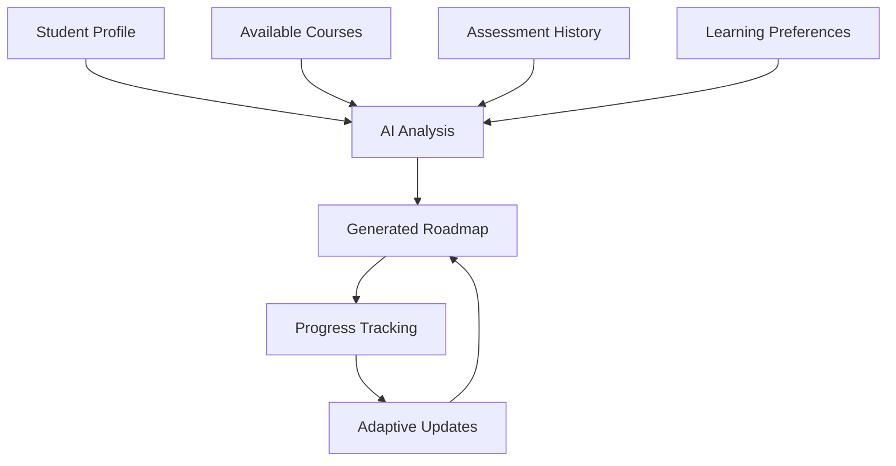

# AI-Powered Personalized Roadmap Generation Guide

## Overview

The AI-Powered Personalized Roadmap Generation system creates customized learning paths for students based on their knowledge profiles, learning preferences, assessment history, and available courses. This system leverages large language models to analyze student data and generate intelligent, adaptive learning sequences.

## Architecture

### Core Components

1. **RoadmapService** - Main service for roadmap generation and management
2. **AI Integration Layer** - Interfaces with LLM providers for intelligent analysis
3. **PersonalizedRoadmap Component** - Student-facing roadmap visualization
4. **RoadmapSettings Component** - Preference customization interface
5. **RoadmapManagement Component** - Instructor oversight tools

### Data Flow



## Personalization Factors

### Student Knowledge Profile

The system analyzes multiple data points to understand student capabilities:

- **Completed Content**: Previously finished courses, lessons, and assessments
- **Assessment Scores**: Performance history across different topics
- **Knowledge Gaps**: Areas where the student needs improvement
- **Skill Levels**: Current proficiency in various subject areas

### Learning Preferences

Students can customize their learning experience through:

- **Learning Pace**: Slow & steady, moderate, or fast track
- **Learning Style**: Visual, auditory, kinesthetic, or mixed
- **Preferred Media Types**: Text, videos, images, documents, YouTube content
- **Time Constraints**: Available hours per week and target completion dates

### Course Analysis

The AI system evaluates available courses based on:

- **Difficulty Progression**: Logical sequencing from basic to advanced
- **Prerequisites**: Required knowledge for each course
- **Learning Objectives**: Skills and knowledge gained from each course
- **Content Types**: Variety of media and learning materials

## AI Roadmap Generation Process

### 1. Data Collection

```typescript
interface RoadmapGenerationInput {
  studentProfile: {
    knowledgeProfile: any;
    learningPreferences: any;
    completedContent: string[];
    assessmentHistory: any[];
  };
  availableCourses: Course[];
  targetSkills?: string[];
  timeConstraints?: {
    hoursPerWeek: number;
    targetCompletionDate?: string;
  };
}
```

### 2. AI Analysis

The system sends a structured prompt to the LLM containing:

- Student's current knowledge state
- Learning preferences and constraints
- Available course catalog
- Target skills (if specified)

### 3. Roadmap Generation

The AI generates a structured response including:

```typescript
interface RoadmapData {
  learning_path: LearningPathItem[];
  total_estimated_time: number;
  personalization_reasoning: string;
  alternative_paths: string[];
  success_metrics: string[];
  difficulty_progression: {
    start: 'beginner' | 'intermediate' | 'advanced';
    end: 'beginner' | 'intermediate' | 'advanced';
  };
  personalization_factors: {
    knowledge_gaps: string[];
    learning_preferences: string[];
    time_constraints?: string;
    target_skills?: string[];
  };
}
```

### 4. Validation and Enhancement

- **Data Validation**: Ensures all required fields are present
- **Progress Integration**: Adds current completion status
- **Prerequisite Checking**: Validates learning sequence logic
- **Time Estimation**: Calculates realistic completion timeframes

## Adaptive Roadmap Updates

### Assessment-Based Adjustments

When students complete assessments, the system automatically:

1. **Analyzes Performance**: Reviews scores and areas of difficulty
2. **Identifies Gaps**: Determines knowledge areas needing reinforcement
3. **Adjusts Path**: Modifies upcoming content or adds remedial materials
4. **Updates Reasoning**: Provides explanations for changes

### Failure Response

For failed assessments, the system:

- Adds review content before retaking
- Suggests alternative learning approaches
- Identifies prerequisite knowledge gaps
- Provides additional practice materials

### Success Optimization

For strong performance, the system:

- Accelerates progression through easier content
- Suggests advanced or enrichment materials
- Adjusts difficulty levels appropriately
- Maintains engagement with challenging content

## Student Interface Features

### Roadmap Visualization

- **Progress Timeline**: Visual representation of learning path
- **Step-by-Step Breakdown**: Detailed view of each learning item
- **Completion Tracking**: Real-time progress indicators
- **Difficulty Indicators**: Clear labeling of content complexity

### Personalization Transparency

- **AI Reasoning Display**: Explanations for roadmap decisions
- **Alternative Paths**: Other possible learning approaches
- **Customization Options**: Ability to adjust preferences
- **Success Metrics**: Clear goals and measurement criteria

### Interactive Elements

- **Content Navigation**: Direct links to learning materials
- **Progress Updates**: Real-time completion tracking
- **Preference Adjustment**: Easy modification of learning settings
- **Roadmap Regeneration**: Option to create new paths

## Instructor Management Tools

### Student Overview

- **Roadmap Monitoring**: View all student learning paths
- **Progress Tracking**: Monitor completion rates and performance
- **Intervention Alerts**: Notifications for struggling students
- **Analytics Dashboard**: Aggregate performance metrics

### Roadmap Management

- **Manual Generation**: Create roadmaps for specific students
- **Bulk Operations**: Generate roadmaps for entire classes
- **Custom Adjustments**: Override AI recommendations when needed
- **Performance Analysis**: Review roadmap effectiveness

## Customization Options

### Target Skills Configuration

Students can specify:
- Specific technologies or frameworks
- Career-focused skill sets
- Academic subject areas
- Professional certifications

### Time Constraint Settings

- **Weekly Availability**: Hours available for learning
- **Deadline Pressure**: Target completion dates
- **Flexible Scheduling**: Adaptive timing based on progress
- **Break Periods**: Account for holidays or busy periods

### Learning Style Preferences

- **Content Type Priorities**: Preferred media formats
- **Interaction Levels**: Passive vs. active learning preference
- **Difficulty Progression**: Gradual vs. challenging advancement
- **Review Frequency**: How often to revisit previous material

## Quality Assurance

### AI Response Validation

- **Structure Verification**: Ensures proper JSON format
- **Content Validation**: Checks for required fields and logical sequences
- **Fallback Mechanisms**: Rule-based generation when AI fails
- **Error Handling**: Graceful degradation for service issues

### Educational Soundness

- **Prerequisite Logic**: Validates learning dependencies
- **Difficulty Progression**: Ensures appropriate skill building
- **Time Realism**: Provides achievable completion estimates
- **Learning Objectives**: Aligns content with educational goals

## Performance Optimization

### Caching Strategies

- **Profile Caching**: Store frequently accessed student data
- **Course Metadata**: Cache course information for quick access
- **Generated Roadmaps**: Store completed roadmaps for reuse
- **AI Responses**: Cache similar requests to reduce API calls

### Rate Limiting

- **API Throttling**: Manage requests to AI services
- **User Limits**: Prevent excessive roadmap regeneration
- **Priority Queuing**: Handle instructor requests with higher priority
- **Fallback Activation**: Switch to rule-based generation under load

## Troubleshooting

### Common Issues

1. **Empty Roadmaps**: Usually due to insufficient course data
2. **Illogical Sequences**: May indicate prerequisite data issues
3. **AI Service Failures**: Fallback to rule-based generation
4. **Performance Issues**: Check caching and rate limiting

### Debugging Tools

- **Roadmap Validation**: Built-in checks for data integrity
- **AI Response Logging**: Track LLM interactions for analysis
- **Performance Metrics**: Monitor generation times and success rates
- **User Feedback**: Collect student and instructor input

### Recovery Procedures

- **Service Restoration**: Steps for AI service outages
- **Data Recovery**: Restore corrupted roadmap data
- **Fallback Activation**: Manual override to rule-based generation
- **User Communication**: Notify users of service issues

## Best Practices

### For Students

1. **Complete Knowledge Assessments**: Provide accurate baseline data
2. **Update Preferences Regularly**: Keep learning settings current
3. **Provide Feedback**: Help improve roadmap quality
4. **Follow Recommended Sequence**: Trust the AI-generated path

### For Instructors

1. **Monitor Student Progress**: Regular check-ins on roadmap effectiveness
2. **Customize When Needed**: Override AI recommendations for specific cases
3. **Analyze Patterns**: Look for common issues across students
4. **Provide Course Metadata**: Ensure accurate course information

### For Administrators

1. **Monitor AI Service Health**: Track API performance and costs
2. **Analyze Usage Patterns**: Understand system load and optimization needs
3. **Update Training Data**: Improve AI responses with new examples
4. **Maintain Fallback Systems**: Ensure rule-based generation works

## Future Enhancements

### Planned Features

- **Multi-Modal Learning**: Integration with VR/AR content
- **Peer Learning**: Collaborative roadmap elements
- **Industry Integration**: Real-world project incorporation
- **Advanced Analytics**: Predictive performance modeling

### Research Areas

- **Learning Style Detection**: Automatic preference identification
- **Emotional Intelligence**: Mood-based roadmap adjustments
- **Social Learning**: Group-based roadmap generation
- **Micro-Learning**: Bite-sized content optimization

## API Reference

### Generate Roadmap

```http
POST /api/roadmap/generate
Content-Type: application/json

{
  "studentId": "uuid",
  "targetSkills": ["JavaScript", "React"],
  "timeConstraints": {
    "hoursPerWeek": 10,
    "targetCompletionDate": "2024-12-31"
  },
  "forceRegenerate": true
}
```

### Get Student Roadmap

```http
GET /api/roadmap/{studentId}
```

### Update Roadmap Progress

```http
POST /api/roadmap/update-progress
Content-Type: application/json

{
  "studentId": "uuid",
  "assessmentId": "uuid",
  "passed": true,
  "score": 85
}
```

This comprehensive guide provides all the information needed to understand, implement, and maintain the AI-powered personalized roadmap generation system.