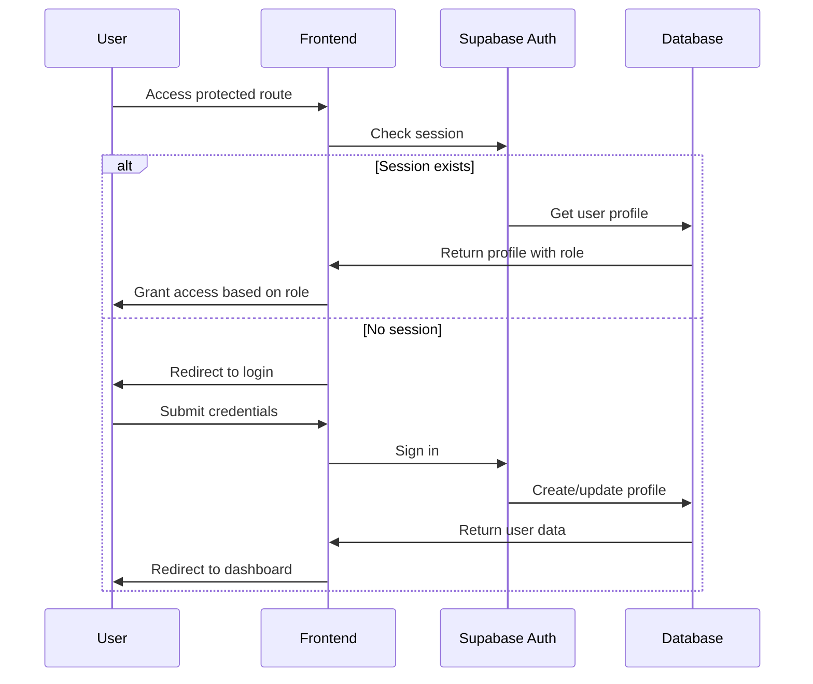

# Authentication System Documentation

## Overview

The Personalized LMS uses Supabase Auth for user authentication and authorization. The system supports role-based access control with three user roles: student, instructor, and admin.

## Authentication Flow



## User Roles and Permissions

### Student Role
- **Access**: Student dashboard, enrolled courses, assessments, profile management
- **Restrictions**: Cannot create courses or access instructor features
- **Default role**: New users are assigned student role by default

### Instructor Role
- **Access**: Instructor dashboard, course creation/management, student analytics, all student features
- **Restrictions**: Cannot access admin-only features
- **Assignment**: Must be manually assigned or selected during registration

### Admin Role
- **Access**: All system features, user management, system configuration
- **Restrictions**: None
- **Assignment**: Must be manually assigned by existing admin

## Implementation Status

✅ **Completed Features:**
- User registration with role selection
- Email/password authentication
- Password reset functionality
- Session management with automatic refresh
- Role-based route protection
- User profile management
- Logout with confirmation
- Authentication state management with Svelte stores
- Server-side session validation
- Automatic redirects based on user role

## Authentication Components

### Auth Store (`src/lib/stores/auth.ts`)

The authentication store manages user state throughout the application:

```typescript
interface AuthState {
  user: User | null;           // Supabase user object
  profile: UserProfile | null; // Extended user profile
  loading: boolean;            // Loading state
  initialized: boolean;        // Initialization status
  error: string | null;        // Error messages
}
```

**Key Features:**
- Reactive authentication state
- Automatic profile loading
- Session persistence
- Error handling
- Logout functionality

### Authentication Routes

**Available Routes:**
- `/auth` - Combined login/register/reset password page
- `/auth/confirm` - Email confirmation
- `/auth/error` - Authentication error handling
- `/auth/reset-password` - Password reset form

### Server-Side Authentication (`src/hooks.server.ts`)

The server hook provides:
- Session validation on every request
- User profile loading
- Route protection for authenticated areas
- Automatic redirects based on authentication state
- Role-based access control

### Protected Routes

**Authentication Required:**
- `/dashboard/*` - All dashboard routes
- `/profile` - User profile management
- `/courses/*` - Course-related pages
- `/lessons/*` - Lesson content
- `/assessments/*` - Assessment pages

**Role-Based Access:**
- Student routes: `/dashboard/student/*`
- Instructor routes: `/dashboard/instructor/*`
- Admin routes: `/dashboard/admin/*`

### Core Services

#### AuthService (`src/lib/services/auth.ts`)
Handles all authentication operations:
- User registration and login
- Password reset functionality
- Profile management
- Role-based access control

```typescript
// Example usage
const { user, error } = await AuthService.signIn({ email, password });
const { profile } = await AuthService.getProfile(userId);
```

#### Auth Store (`src/lib/stores/auth.ts`)
Manages authentication state across the application:
- User session state
- Profile information
- Loading states
- Error handling

```typescript
// Example usage
import { isAuthenticated, profile, userRole } from '$lib/stores/auth';

// Reactive access to auth state
$: if ($isAuthenticated) {
  console.log('User is logged in:', $profile);
}
```

### Authentication Middleware

#### Route Protection (`src/lib/middleware/auth.ts`)
Provides server-side route protection:

```typescript
// Protect routes requiring authentication
export const load: PageServerLoad = async (event) => {
  const { user, profile } = await requireAuth(event);
  return { user, profile };
};

// Protect routes requiring specific roles
export const load: PageServerLoad = async (event) => {
  const { user, profile } = await requireInstructor(event);
  return { user, profile };
};
```

Available middleware functions:
- `requireAuth()` - Requires any authenticated user
- `requireStudent()` - Requires student role
- `requireInstructor()` - Requires instructor or admin role
- `requireAdmin()` - Requires admin role
- `optionalAuth()` - Allows both authenticated and unauthenticated users

### UI Components

#### Authentication Forms
- `LoginForm.svelte` - User sign-in interface
- `RegisterForm.svelte` - User registration with role selection
- `ForgotPasswordForm.svelte` - Password reset request
- `ResetPasswordForm.svelte` - New password setting
- `ProfileForm.svelte` - Profile management interface

All forms include:
- Input validation
- Error handling
- Loading states
- Accessibility features (ARIA labels, keyboard navigation)

## Security Features

### Password Requirements
- Minimum 6 characters
- Enforced by both client and server validation
- Secure password reset via email

### Session Management
- Automatic token refresh
- Persistent sessions across browser restarts
- Secure session storage

### Role-Based Access Control (RBAC)
- Database-level Row Level Security (RLS) policies
- Server-side route protection
- Client-side UI conditional rendering

### Data Protection
- All sensitive data encrypted in transit and at rest
- User profiles stored separately from auth data
- Secure password reset tokens

## Database Schema

### Profiles Table
```sql
CREATE TABLE profiles (
  id UUID REFERENCES auth.users PRIMARY KEY,
  email TEXT UNIQUE NOT NULL,
  role user_role NOT NULL DEFAULT 'student',
  first_name TEXT,
  last_name TEXT,
  avatar_url TEXT,
  learning_preferences JSONB,
  knowledge_profile JSONB,
  created_at TIMESTAMP WITH TIME ZONE DEFAULT NOW(),
  updated_at TIMESTAMP WITH TIME ZONE DEFAULT NOW()
);
```

### Row Level Security Policies
```sql
-- Users can view their own profile
CREATE POLICY "Users can view own profile" ON profiles
  FOR SELECT USING (auth.uid() = id);

-- Users can update their own profile
CREATE POLICY "Users can update own profile" ON profiles
  FOR UPDATE USING (auth.uid() = id);

-- Instructors can view student profiles in their courses
CREATE POLICY "Instructors can view enrolled students" ON profiles
  FOR SELECT USING (
    role = 'student' AND id IN (
      SELECT student_id FROM enrollments 
      WHERE course_id IN (
        SELECT id FROM courses WHERE instructor_id = auth.uid()
      )
    )
  );
```

## Error Handling

### Authentication Errors
- Invalid credentials
- Account not verified
- Password reset failures
- Session expiration

### Authorization Errors
- Insufficient permissions
- Role mismatch
- Unauthorized resource access

### Error Display
All authentication errors are displayed to users with:
- Clear, actionable error messages
- Appropriate ARIA labels for screen readers
- Consistent styling and positioning

## Session Management

### Initialization
The auth store automatically initializes on app load:
1. Checks for existing session
2. Loads user profile if authenticated
3. Sets up auth state change listeners

### State Persistence
- Sessions persist across browser restarts
- Automatic token refresh prevents session expiration
- Graceful handling of network interruptions

### Logout Process
1. Clear Supabase session
2. Reset auth store state
3. Clear any cached user data
4. Redirect to home page

## Token Handling

### Access Tokens
- Automatically managed by Supabase client
- Included in all API requests
- Refreshed automatically before expiration

### Refresh Tokens
- Stored securely by Supabase
- Used to obtain new access tokens
- Rotated on each refresh for security

## User State Management

### Client-Side State
The auth store provides reactive access to:
- Current user information
- User profile data
- Authentication status
- Loading states

### Server-Side State
Server-side routes can access user information through:
- Middleware functions
- Session validation
- Profile data retrieval

## Best Practices

### Security
1. Always validate user permissions on the server
2. Use middleware for route protection
3. Implement proper error handling
4. Follow principle of least privilege

### User Experience
1. Provide clear feedback for all auth actions
2. Handle loading states appropriately
3. Implement proper error messages
4. Support keyboard navigation

### Development
1. Use TypeScript for type safety
2. Implement proper error boundaries
3. Test authentication flows thoroughly
4. Document role requirements for routes

## Testing Authentication

### Unit Tests
Test individual auth functions:
```typescript
// Test auth service methods
test('should sign in user with valid credentials', async () => {
  const result = await AuthService.signIn({ email, password });
  expect(result.user).toBeTruthy();
  expect(result.error).toBeNull();
});
```

### Integration Tests
Test complete auth flows:
```typescript
// Test protected route access
test('should redirect unauthenticated user to login', async () => {
  const response = await request('/dashboard');
  expect(response.status).toBe(302);
  expect(response.headers.location).toBe('/auth/login');
});
```

### E2E Tests
Test user authentication journeys:
```typescript
// Test complete registration flow
test('user can register and access dashboard', async ({ page }) => {
  await page.goto('/auth/register');
  await page.fill('[data-testid=email]', 'test@example.com');
  await page.fill('[data-testid=password]', 'password123');
  await page.click('[data-testid=submit]');
  await expect(page).toHaveURL('/dashboard/student');
});
```

## Troubleshooting

### Common Issues

#### "Session not found" errors
- Check if user has verified their email
- Verify Supabase configuration
- Check browser storage permissions

#### Role-based access issues
- Verify user role in database
- Check RLS policies
- Ensure middleware is properly configured

#### Password reset not working
- Check email configuration in Supabase
- Verify redirect URLs
- Check spam folder for reset emails

### Debug Tools
- Supabase Auth logs in dashboard
- Browser developer tools for client-side debugging
- Server logs for middleware issues

## Migration and Updates

### User Data Migration
When updating user schema:
1. Create database migration
2. Update TypeScript interfaces
3. Update auth service methods
4. Test with existing users

### Role Changes
When modifying roles:
1. Update database enum types
2. Update RLS policies
3. Update middleware functions
4. Test permission changes

This authentication system provides a secure, scalable foundation for the Personalized LMS with proper role-based access control and comprehensive error handling.