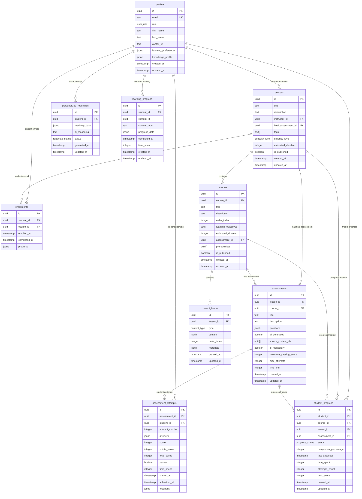

# Database Schema Documentation

## Overview

The Personalized LMS uses a PostgreSQL database hosted on Supabase with comprehensive Row Level Security (RLS) policies. The schema is designed to support multi-tenant access with role-based permissions for students, instructors, and administrators.

## Entity Relationship Diagram



## Custom Types

### Enums

```sql
-- User roles in the system
CREATE TYPE user_role AS ENUM ('student', 'instructor', 'admin');

-- Difficulty levels for courses and content
CREATE TYPE difficulty_level AS ENUM ('beginner', 'intermediate', 'advanced');

-- Types of content blocks
CREATE TYPE content_type AS ENUM ('rich_text', 'image', 'video', 'file', 'youtube');

-- Status of personalized roadmaps
CREATE TYPE roadmap_status AS ENUM ('active', 'completed', 'paused');

-- Progress status for learning content
CREATE TYPE progress_status AS ENUM ('not_started', 'in_progress', 'completed', 'blocked');
```

## Table Descriptions

### profiles
Extends Supabase's `auth.users` table with additional profile information and learning preferences.

**Key Features:**
- Automatically created when a user signs up via trigger
- Stores learning preferences and knowledge profiles as JSONB
- Role-based access control (student, instructor, admin)

**Relationships:**
- One-to-many with courses (as instructor)
- One-to-many with enrollments (as student)
- One-to-many with assessment attempts
- One-to-many with progress tracking

### courses
Represents learning courses created by instructors.

**Key Features:**
- Hierarchical structure with lessons
- Mandatory final assessment
- Publishing workflow (draft/published)
- Tagging and difficulty classification

**Relationships:**
- Belongs to instructor (profiles)
- Has many lessons
- Has many enrollments
- Has one final assessment

### lessons
Individual learning units within courses.

**Key Features:**
- Ordered sequence within courses
- Multiple content blocks per lesson
- Mandatory assessment per lesson
- Prerequisite system for sequential learning

**Relationships:**
- Belongs to course
- Has many content blocks
- Has one assessment
- Can have prerequisite lessons

### content_blocks ✅ IMPLEMENTED
Individual pieces of content within lessons supporting the unified lesson editor.

**Key Features:**
- ✅ Support for multiple media types with dedicated editors
- ✅ Ordered sequence within lessons with drag-and-drop reordering
- ✅ Flexible JSONB content storage for different content types
- ✅ Metadata for additional properties (title, description, accessibility notes)
- ✅ Validation for content completeness and accessibility compliance

**Content Types:**
- ✅ `rich_text`: HTML content with Tiptap editor integration, word count, and sanitization
- ✅ `image`: Images with mandatory alt text, optional captions, and upload support
- ✅ `video`: Uploaded video files with HTML5 player and metadata tracking
- ✅ `file`: Downloadable files with metadata display and direct download links
- ✅ `youtube`: Embedded YouTube videos with URL validation and metadata extraction

**Content Structure Examples:**
```json
// Rich Text Content
{
  "rich_text": {
    "html": "<h2>Introduction</h2><p>Welcome to this lesson...</p>",
    "plain_text": "Introduction\nWelcome to this lesson...",
    "word_count": 25
  }
}

// Image Content
{
  "image": {
    "url": "https://storage.supabase.co/...",
    "alt_text": "Diagram showing the water cycle process",
    "caption": "The water cycle includes evaporation, condensation, and precipitation",
    "width": 800,
    "height": 600
  }
}

// YouTube Content
{
  "youtube": {
    "video_id": "dQw4w9WgXcQ",
    "title": "Educational Video Title",
    "thumbnail_url": "https://img.youtube.com/vi/...",
    "duration": 240
  }
}
```

**Metadata Structure:**
```json
{
  "title": "Content Block Title",
  "description": "Brief description of the content",
  "accessibility_notes": "Additional accessibility information",
  "estimated_read_time": 5,
  "tags": ["introduction", "concept"]
}
```

### enrollments
Tracks student enrollment in courses.

**Key Features:**
- Prevents duplicate enrollments
- Tracks completion status
- Stores progress data as JSONB

### assessments
Quizzes and tests for lessons and courses.

**Key Features:**
- AI-generated or manually created
- Multiple question types support
- Configurable passing scores and attempt limits
- Time limits for timed assessments

**Question Types Supported:**
- Multiple choice
- True/false
- Short answer
- Essay questions

### assessment_attempts
Individual attempts at assessments by students.

**Key Features:**
- Tracks multiple attempts per assessment
- Detailed answer storage
- Automatic scoring and feedback
- Time tracking for performance analysis

### student_progress
Comprehensive progress tracking for all learning activities.

**Key Features:**
- Granular progress tracking
- Performance metrics
- Time spent analytics
- Completion percentages

### personalized_roadmaps
AI-generated learning paths for individual students.

**Key Features:**
- AI reasoning transparency
- Dynamic updates based on performance
- Status tracking (active/completed/paused)

### learning_progress
Detailed analytics for learning behavior.

**Key Features:**
- Flexible content tracking
- Detailed progress data as JSONB
- Time-based analytics

## Row Level Security (RLS) Policies

### Security Principles

1. **Data Isolation**: Users can only access data they own or are authorized to view
2. **Role-Based Access**: Different permissions for students, instructors, and admins
3. **Course-Based Access**: Students can only access enrolled courses
4. **Instructor Ownership**: Instructors can only manage their own courses
5. **Admin Override**: Administrators have full access for system management

### Policy Examples

#### Profile Access
```sql
-- Users can view and update their own profile
CREATE POLICY "Users can view own profile" ON profiles
  FOR SELECT USING (auth.uid() = id);

-- Instructors can view student profiles for course management
CREATE POLICY "Instructors can view student profiles" ON profiles
  FOR SELECT USING (
    auth.uid() IN (
      SELECT id FROM profiles WHERE role IN ('instructor', 'admin')
    )
  );
```

#### Course Access
```sql
-- Anyone can view published courses
CREATE POLICY "Anyone can view published courses" ON courses
  FOR SELECT USING (is_published = true);

-- Students can view enrolled courses (even unpublished)
CREATE POLICY "Students can view enrolled courses" ON courses
  FOR SELECT USING (
    id IN (
      SELECT course_id FROM enrollments 
      WHERE student_id = auth.uid()
    )
  );

-- Instructors can manage their own courses
CREATE POLICY "Instructors can manage own courses" ON courses
  FOR ALL USING (auth.uid() = instructor_id);
```

#### Assessment Security
```sql
-- Students can only view their own assessment attempts
CREATE POLICY "Students can manage own assessment attempts" ON assessment_attempts
  FOR ALL USING (auth.uid() = student_id);

-- Instructors can view attempts for their course assessments
CREATE POLICY "Instructors can view course assessment attempts" ON assessment_attempts
  FOR SELECT USING (
    assessment_id IN (
      SELECT a.id FROM assessments a
      LEFT JOIN lessons l ON a.lesson_id = l.id
      LEFT JOIN courses c1 ON l.course_id = c1.id
      LEFT JOIN courses c2 ON a.course_id = c2.id
      WHERE c1.instructor_id = auth.uid() OR c2.instructor_id = auth.uid()
    )
  );
```

## Indexes and Performance

### Primary Indexes
All tables have UUID primary keys with automatic indexing.

### Performance Indexes
```sql
-- User and role-based queries
CREATE INDEX idx_profiles_email ON profiles(email);
CREATE INDEX idx_profiles_role ON profiles(role);

-- Course and lesson hierarchy
CREATE INDEX idx_courses_instructor ON courses(instructor_id);
CREATE INDEX idx_lessons_course ON lessons(course_id);
CREATE INDEX idx_lessons_order ON lessons(course_id, order_index);

-- Content and media
CREATE INDEX idx_content_blocks_lesson ON content_blocks(lesson_id);
CREATE INDEX idx_content_blocks_order ON content_blocks(lesson_id, order_index);

-- Assessment and progress tracking
CREATE INDEX idx_assessment_attempts_student ON assessment_attempts(student_id);
CREATE INDEX idx_student_progress_student ON student_progress(student_id);
CREATE INDEX idx_student_progress_course ON student_progress(course_id);
```

## Triggers and Functions

### Automatic Profile Creation
```sql
-- Function to create profile on user signup
CREATE OR REPLACE FUNCTION public.handle_new_user()
RETURNS TRIGGER AS $$
BEGIN
  INSERT INTO public.profiles (id, email, role)
  VALUES (NEW.id, NEW.email, 'student');
  RETURN NEW;
END;
$$ LANGUAGE plpgsql SECURITY DEFINER;

-- Trigger to execute function on user creation
CREATE TRIGGER on_auth_user_created
  AFTER INSERT ON auth.users
  FOR EACH ROW EXECUTE FUNCTION public.handle_new_user();
```

### Automatic Timestamp Updates
```sql
-- Function to update updated_at column
CREATE OR REPLACE FUNCTION update_updated_at_column()
RETURNS TRIGGER AS $$
BEGIN
    NEW.updated_at = NOW();
    RETURN NEW;
END;
$$ language 'plpgsql';

-- Applied to all tables with updated_at columns
CREATE TRIGGER update_profiles_updated_at BEFORE UPDATE ON profiles 
  FOR EACH ROW EXECUTE FUNCTION update_updated_at_column();
```

## Data Validation

### Constraints
- **Unique Constraints**: Prevent duplicate enrollments, ensure unique email addresses
- **Check Constraints**: Validate percentage values (0-100), ensure positive durations
- **Foreign Key Constraints**: Maintain referential integrity across all relationships
- **Assessment Constraints**: Ensure assessments belong to either lesson OR course, not both

### JSONB Schema Validation
While JSONB fields are flexible, the application enforces schema validation:

#### Learning Preferences Schema
```typescript
interface LearningPreferences {
  preferred_pace: 'slow' | 'medium' | 'fast';
  preferred_media_types: ContentType[];
  learning_style: 'visual' | 'auditory' | 'kinesthetic' | 'mixed';
}
```

#### Content Block Schema
```typescript
interface ContentData {
  rich_text?: {
    html: string;
    plain_text: string;
  };
  image?: {
    url: string;
    alt_text: string;
    caption?: string;
  };
  video?: {
    url: string;
    thumbnail_url?: string;
    duration?: number;
  };
  file?: {
    url: string;
    filename: string;
    file_type: string;
    file_size: number;
  };
  youtube?: {
    video_id: string;
    title: string;
    thumbnail_url: string;
    duration: number;
  };
}
```

## Migration Strategy

### Development Workflow
1. Create migration files in `supabase/migrations/`
2. Test migrations locally with `supabase db reset`
3. Apply to staging environment
4. Deploy to production with `supabase db push`

### Migration Naming Convention
- Format: `YYYYMMDDHHMMSS_description.sql`
- Example: `20240101000001_initial_schema.sql`

### Rollback Strategy
- Each migration should include rollback instructions in comments
- Use transactions for atomic migrations
- Test rollback procedures in staging environment

## Backup and Restore Procedures

### Automated Backups
Supabase provides automated daily backups with point-in-time recovery.

### Manual Backup
```bash
# Export schema and data
pg_dump -h your-host -U postgres -d your-database > backup.sql

# Schema only
pg_dump -h your-host -U postgres -d your-database --schema-only > schema.sql

# Data only
pg_dump -h your-host -U postgres -d your-database --data-only > data.sql
```

### Restore Procedures
```bash
# Full restore
psql -h your-host -U postgres -d your-database < backup.sql

# Schema restore
psql -h your-host -U postgres -d your-database < schema.sql

# Data restore
psql -h your-host -U postgres -d your-database < data.sql
```

### Disaster Recovery
1. **RTO (Recovery Time Objective)**: 4 hours maximum
2. **RPO (Recovery Point Objective)**: 1 hour maximum data loss
3. **Backup Retention**: 30 days for production, 7 days for staging
4. **Testing**: Monthly disaster recovery drills

## Security Considerations

### Data Encryption
- **At Rest**: All data encrypted using AES-256
- **In Transit**: TLS 1.3 for all connections
- **Application Level**: Sensitive fields encrypted before storage

### Access Control
- **Authentication**: Supabase Auth with JWT tokens
- **Authorization**: Row Level Security policies
- **API Security**: Rate limiting and request validation

### Compliance
- **GDPR**: Data portability and deletion capabilities
- **CCPA**: User data access and deletion rights
- **FERPA**: Educational record privacy protection

### Audit Logging
- All data modifications logged with user ID and timestamp
- Failed authentication attempts tracked
- Administrative actions logged for compliance

## Performance Monitoring

### Key Metrics
- Query execution time
- Connection pool utilization
- Index usage statistics
- Table size growth

### Optimization Strategies
- Regular VACUUM and ANALYZE operations
- Index optimization based on query patterns
- Partitioning for large tables (future consideration)
- Connection pooling configuration

### Alerting
- Slow query alerts (>1 second)
- High connection count alerts
- Disk space utilization alerts
- Failed backup alerts

This comprehensive database schema provides a solid foundation for the Personalized LMS with proper security, performance, and maintainability considerations.
## Cour
se Management Schema Updates

The Course Management System has been fully implemented with the following schema enhancements:

### Enhanced Course Table

The `courses` table now includes comprehensive metadata for course management:

```sql
CREATE TABLE courses (
    id UUID PRIMARY KEY DEFAULT gen_random_uuid(),
    title TEXT NOT NULL CHECK (length(title) >= 3 AND length(title) <= 200),
    description TEXT,
    instructor_id UUID NOT NULL REFERENCES profiles(id) ON DELETE CASCADE,
    final_assessment_id UUID REFERENCES assessments(id) ON DELETE SET NULL,
    tags TEXT[] DEFAULT '{}',
    difficulty_level difficulty_level NOT NULL DEFAULT 'beginner',
    estimated_duration INTEGER CHECK (estimated_duration > 0 AND estimated_duration <= 10080),
    is_published BOOLEAN NOT NULL DEFAULT false,
    enrollment_count INTEGER DEFAULT 0,
    completion_rate DECIMAL(5,2) DEFAULT 0.00,
    created_at TIMESTAMP WITH TIME ZONE DEFAULT NOW(),
    updated_at TIMESTAMP WITH TIME ZONE DEFAULT NOW()
);

-- Indexes for performance
CREATE INDEX idx_courses_instructor_id ON courses(instructor_id);
CREATE INDEX idx_courses_published ON courses(is_published) WHERE is_published = true;
CREATE INDEX idx_courses_difficulty ON courses(difficulty_level);
CREATE INDEX idx_courses_tags ON courses USING GIN(tags);
CREATE INDEX idx_courses_title_search ON courses USING GIN(to_tsvector('english', title || ' ' || COALESCE(description, '')));
```

### Enrollment Management

The `enrollments` table tracks student course enrollments:

```sql
CREATE TABLE enrollments (
    id UUID PRIMARY KEY DEFAULT gen_random_uuid(),
    student_id UUID NOT NULL REFERENCES profiles(id) ON DELETE CASCADE,
    course_id UUID NOT NULL REFERENCES courses(id) ON DELETE CASCADE,
    enrolled_at TIMESTAMP WITH TIME ZONE DEFAULT NOW(),
    completed_at TIMESTAMP WITH TIME ZONE,
    progress JSONB DEFAULT '{}',
    
    UNIQUE(student_id, course_id)
);

-- Indexes
CREATE INDEX idx_enrollments_student_id ON enrollments(student_id);
CREATE INDEX idx_enrollments_course_id ON enrollments(course_id);
CREATE INDEX idx_enrollments_enrolled_at ON enrollments(enrolled_at);
CREATE INDEX idx_enrollments_completed ON enrollments(completed_at) WHERE completed_at IS NOT NULL;
```

### Course Analytics Support

Additional tables and functions support comprehensive course analytics:

```sql
-- Course analytics materialized view for performance
CREATE MATERIALIZED VIEW course_analytics AS
SELECT 
    c.id as course_id,
    c.title,
    c.instructor_id,
    COUNT(e.id) as total_enrollments,
    COUNT(e.completed_at) as total_completions,
    CASE 
        WHEN COUNT(e.id) > 0 
        THEN ROUND((COUNT(e.completed_at)::DECIMAL / COUNT(e.id)) * 100, 2)
        ELSE 0 
    END as completion_rate,
    AVG(EXTRACT(EPOCH FROM (e.completed_at - e.enrolled_at))/3600) as avg_completion_hours,
    COUNT(CASE WHEN e.enrolled_at >= NOW() - INTERVAL '30 days' THEN 1 END) as recent_enrollments
FROM courses c
LEFT JOIN enrollments e ON c.id = e.course_id
WHERE c.is_published = true
GROUP BY c.id, c.title, c.instructor_id;

-- Refresh analytics periodically
CREATE INDEX idx_course_analytics_course_id ON course_analytics(course_id);
CREATE INDEX idx_course_analytics_instructor_id ON course_analytics(instructor_id);
```

### Row Level Security Policies

Enhanced RLS policies for course management:

```sql
-- Courses table policies
CREATE POLICY "Public can view published courses" ON courses
    FOR SELECT USING (is_published = true);

CREATE POLICY "Instructors can view their own courses" ON courses
    FOR SELECT USING (instructor_id = auth.uid());

CREATE POLICY "Instructors can create courses" ON courses
    FOR INSERT WITH CHECK (instructor_id = auth.uid());

CREATE POLICY "Instructors can update their own courses" ON courses
    FOR UPDATE USING (instructor_id = auth.uid());

CREATE POLICY "Instructors can delete their own courses" ON courses
    FOR DELETE USING (instructor_id = auth.uid());

-- Enrollments table policies
CREATE POLICY "Students can view their own enrollments" ON enrollments
    FOR SELECT USING (student_id = auth.uid());

CREATE POLICY "Students can enroll in published courses" ON enrollments
    FOR INSERT WITH CHECK (
        student_id = auth.uid() AND 
        EXISTS (SELECT 1 FROM courses WHERE id = course_id AND is_published = true)
    );

CREATE POLICY "Students can update their own enrollment progress" ON enrollments
    FOR UPDATE USING (student_id = auth.uid());

CREATE POLICY "Instructors can view enrollments for their courses" ON enrollments
    FOR SELECT USING (
        EXISTS (SELECT 1 FROM courses WHERE id = course_id AND instructor_id = auth.uid())
    );
```

### Database Functions

Custom functions support course management operations:

```sql
-- Function to update course enrollment count
CREATE OR REPLACE FUNCTION update_course_enrollment_count()
RETURNS TRIGGER AS $$
BEGIN
    IF TG_OP = 'INSERT' THEN
        UPDATE courses 
        SET enrollment_count = enrollment_count + 1,
            updated_at = NOW()
        WHERE id = NEW.course_id;
        RETURN NEW;
    ELSIF TG_OP = 'DELETE' THEN
        UPDATE courses 
        SET enrollment_count = GREATEST(enrollment_count - 1, 0),
            updated_at = NOW()
        WHERE id = OLD.course_id;
        RETURN OLD;
    END IF;
    RETURN NULL;
END;
$$ LANGUAGE plpgsql;

-- Trigger to automatically update enrollment counts
CREATE TRIGGER trigger_update_enrollment_count
    AFTER INSERT OR DELETE ON enrollments
    FOR EACH ROW EXECUTE FUNCTION update_course_enrollment_count();

-- Function to calculate course completion rate
CREATE OR REPLACE FUNCTION update_course_completion_rate()
RETURNS TRIGGER AS $$
BEGIN
    UPDATE courses 
    SET completion_rate = (
        SELECT CASE 
            WHEN COUNT(*) > 0 
            THEN ROUND((COUNT(completed_at)::DECIMAL / COUNT(*)) * 100, 2)
            ELSE 0 
        END
        FROM enrollments 
        WHERE course_id = COALESCE(NEW.course_id, OLD.course_id)
    ),
    updated_at = NOW()
    WHERE id = COALESCE(NEW.course_id, OLD.course_id);
    
    RETURN COALESCE(NEW, OLD);
END;
$$ LANGUAGE plpgsql;

-- Trigger to update completion rates
CREATE TRIGGER trigger_update_completion_rate
    AFTER INSERT OR UPDATE OR DELETE ON enrollments
    FOR EACH ROW EXECUTE FUNCTION update_course_completion_rate();
```

### Search and Discovery Features

Full-text search capabilities for course discovery:

```sql
-- Full-text search function
CREATE OR REPLACE FUNCTION search_courses(
    search_query TEXT DEFAULT '',
    difficulty_filter difficulty_level DEFAULT NULL,
    instructor_filter UUID DEFAULT NULL,
    tag_filter TEXT[] DEFAULT NULL,
    limit_count INTEGER DEFAULT 20,
    offset_count INTEGER DEFAULT 0
)
RETURNS TABLE (
    id UUID,
    title TEXT,
    description TEXT,
    instructor_id UUID,
    instructor_name TEXT,
    tags TEXT[],
    difficulty_level difficulty_level,
    estimated_duration INTEGER,
    enrollment_count INTEGER,
    completion_rate DECIMAL,
    created_at TIMESTAMP WITH TIME ZONE,
    rank REAL
) AS $$
BEGIN
    RETURN QUERY
    SELECT 
        c.id,
        c.title,
        c.description,
        c.instructor_id,
        COALESCE(p.first_name || ' ' || p.last_name, p.email) as instructor_name,
        c.tags,
        c.difficulty_level,
        c.estimated_duration,
        c.enrollment_count,
        c.completion_rate,
        c.created_at,
        CASE 
            WHEN search_query = '' THEN 0
            ELSE ts_rank(
                to_tsvector('english', c.title || ' ' || COALESCE(c.description, '')),
                plainto_tsquery('english', search_query)
            )
        END as rank
    FROM courses c
    JOIN profiles p ON c.instructor_id = p.id
    WHERE 
        c.is_published = true
        AND (search_query = '' OR to_tsvector('english', c.title || ' ' || COALESCE(c.description, '')) @@ plainto_tsquery('english', search_query))
        AND (difficulty_filter IS NULL OR c.difficulty_level = difficulty_filter)
        AND (instructor_filter IS NULL OR c.instructor_id = instructor_filter)
        AND (tag_filter IS NULL OR c.tags && tag_filter)
    ORDER BY 
        CASE WHEN search_query = '' THEN c.created_at END DESC,
        CASE WHEN search_query != '' THEN rank END DESC
    LIMIT limit_count
    OFFSET offset_count;
END;
$$ LANGUAGE plpgsql;
```

### Performance Optimizations

The course management system includes several performance optimizations:

1. **Materialized Views**: Course analytics are pre-computed for fast dashboard loading
2. **Strategic Indexing**: Indexes on commonly queried fields (instructor_id, is_published, tags)
3. **Full-Text Search**: GIN indexes for efficient text search across course titles and descriptions
4. **Trigger-Based Updates**: Automatic maintenance of enrollment counts and completion rates
5. **Query Optimization**: Efficient joins and subqueries for complex analytics

### Data Integrity Constraints

The schema enforces data integrity through:

- **Foreign Key Constraints**: Maintain referential integrity between related tables
- **Check Constraints**: Validate data ranges (e.g., duration limits, title length)
- **Unique Constraints**: Prevent duplicate enrollments
- **NOT NULL Constraints**: Ensure required fields are populated
- **Default Values**: Provide sensible defaults for optional fields

This comprehensive course management schema supports all the features implemented in the Course Management System, including course creation, enrollment tracking, analytics, and search functionality.